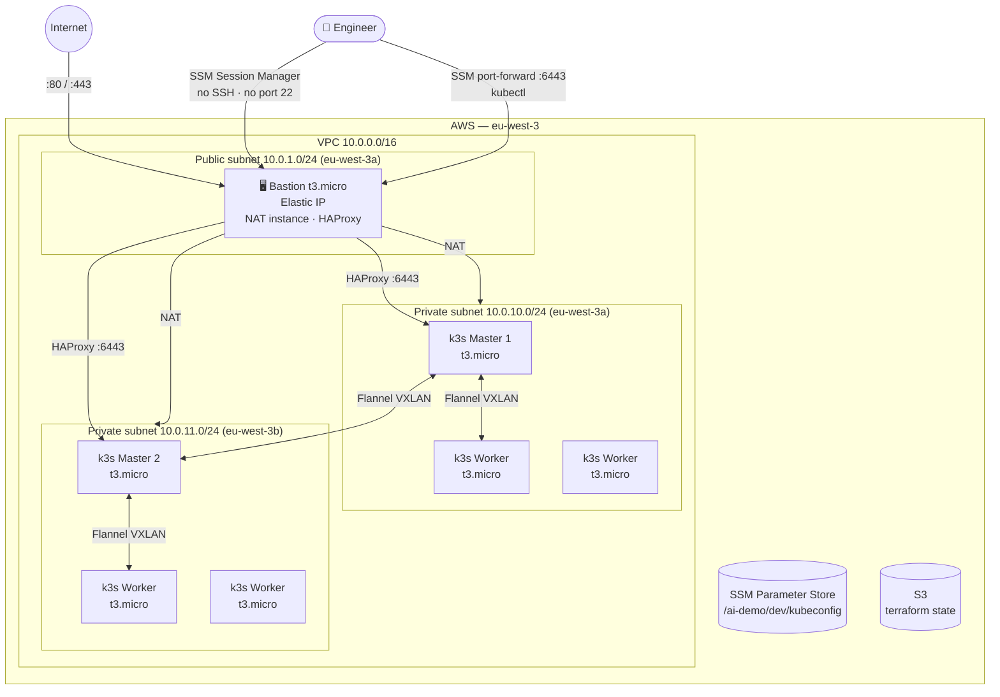
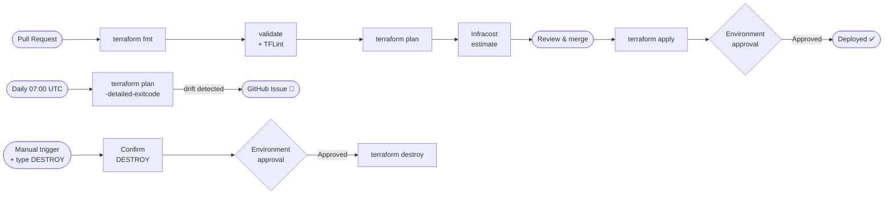

# AI-Assisted DevOps Demo

A production-like Kubernetes platform built with k3s on AWS, provisioned with
Terraform and managed by a GitHub Actions CI/CD pipeline.

> Portfolio project demonstrating DevOps and Platform Engineering best practices,
> developed with AI-assisted engineering using Claude Code.

## Stack

| Layer              | Technology                                                                          |
|--------------------|-------------------------------------------------------------------------------------|
| Cloud              | AWS (EC2, VPC, S3, SSM Session Manager, IAM)                                        |
| IaC                | Terraform 1.10+ — modular (network / bastion / k3s-masters / k3s-workers / platform) |
| Kubernetes         | k3s v1.29                                                                           |
| Config management  | Kustomize (base + overlays)                                                         |
| CI/CD              | GitHub Actions — OIDC auth, Infracost                                               |
| Container registry | GHCR                                                                                |
| Application        | Go — lightweight HTTP service                                                       |

## Architecture



> **No SSH.** All admin access goes through AWS SSM Session Manager.
> kubectl uses SSM port forwarding → HAProxy on the bastion → k3s API.

See [docs/architecture.md](docs/architecture.md) for the full diagram and security model.

## CI/CD pipelines



| Workflow | Trigger | Description |
|----------|---------|-------------|
| `terraform-ci.yml` | PR → `main` (on `terraform/**`) | fmt → validate → TFLint → plan → Infracost |
| `terraform-cd.yml` | Push → `main` (on `terraform/**`) | `terraform apply` + Environment approval |
| `terraform-drift.yml` | Daily 07:00 UTC + manual | Drift detection — opens a GitHub issue on change |
| `terraform-destroy.yml` | Manual only | `terraform destroy` — requires `DESTROY` + Environment approval |
| `app-build-push.yml` | Push/PR on `app/**` | Build & push Docker image to GHCR |

## Repository structure

```
├── .github/workflows/        # CI, CD, drift detection, destroy
├── terraform/
│   ├── bootstrap/            # S3 state bucket + IAM role (run once, local backend)
│   ├── modules/              # network / bastion / k3s-masters / k3s-workers / platform
│   └── environments/         # dev / prod (each with its own backend + variables)
├── kubernetes/
│   ├── base/                 # Kustomize base manifests
│   └── overlays/             # dev / prod patches
├── app/                      # Go application + Dockerfile
├── scripts/                  # get-kubeconfig.sh, destroy.sh
└── docs/                     # Architecture + ADRs
```

## Getting started

See [docs/getting-started.md](docs/getting-started.md).

## Design decisions

See [docs/adr/](docs/adr/) for Architecture Decision Records.

## Note for forks

The S3 state bucket is named `ai-demo-terraform-state-<account_id>` to ensure
global uniqueness. If you fork this project, update the `bucket` field in
`terraform/environments/*/backend.tf` with your own AWS account ID, and run the
bootstrap stack with `create_oidc_provider = true` (or `false` if you already
have a GitHub OIDC provider).
